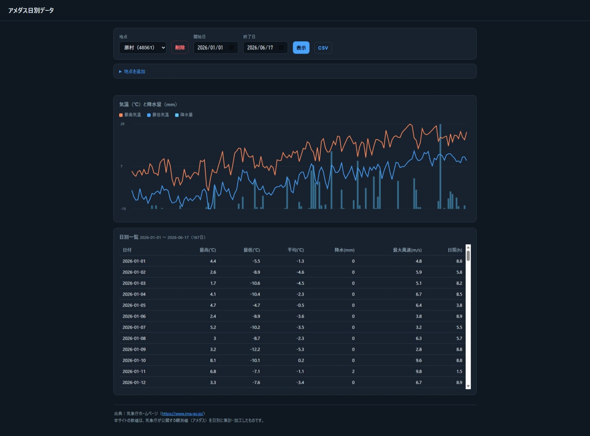

# ni-amedas

気象庁アメダスの**日別気象データ**を Cloudflare Workers + D1 で取得・蓄積し、API と Web UI で提供する小さなシステム。


- 単一の Worker に API・定期収集・静的UI配信をまとめた構成（追加インフラ不要）。
- データソースは気象庁の **bosai API**（直近）と **etrn**（過去・履歴）を自動で使い分け。
- 仕様の正本は [`DESIGN.md`](./DESIGN.md)（`CLAUDE.md` の初期仕様はデータソース記述に誤りが多く、実API検証で修正済み）。



## 特徴

- **自動補完**：閲覧時・cron実行時に欠けている期間を自動取得（前方は直近、後方=過去は etrn で遡及）。
- **多地点対応**：`points` マスタで bosai/etrn の異なるコード体系を吸収。地点追加=1行。
- **地点追加UIがURL1本**：etrnの「日ごとの値」ページのURLを貼るだけで `prec_no`/`block_no` を抽出し、名称・`bosai_code` も自動補完。
- **過去データの遡及取得（backfill）**：開始日を過去に指定すると、その範囲を etrn から取得。
- **CSVダウンロード**：表示中の期間を UTF-8(BOM)付きCSVで出力（Excel対応）。
- **ディープリンク**：`?point=&from=&to=` で初期表示を指定、操作でURLも更新。

## 技術スタック

Cloudflare Workers (TypeScript) / Cloudflare D1 (SQLite) / 静的アセット配信 / 依存ゼロのフロントエンド。
定期実行は外部 cron（[cron-job.org](https://cron-job.org/) など）が保護付きエンドポイントを叩く。

## セットアップ / デプロイ

```bash
npm install
cp wrangler.toml.example wrangler.toml      # 設定ファイルを用意
npx wrangler d1 create amedas-db            # 出力の database_id を wrangler.toml に記入
npx wrangler d1 execute amedas-db --remote --file=schema.sql
npx wrangler secret put CRON_TOKEN          # 任意の秘密トークン（cron/地点追加削除の認証）
# 初回データ投入（etrn を月単位で取得して seed.sql を生成）
npx tsx scripts/seed.ts --point 48561 --from 2020-01-01 --to 2024-12-31
npx wrangler d1 execute amedas-db --remote --file=seed.sql
npx wrangler deploy
```

> `wrangler.toml` は自分の `database_id` を含むため `.gitignore` 済み。リポジトリには
> `wrangler.toml.example` のみを置いています。

## 定期収集（cron）

デプロイ後、cron-job.org 等で毎朝 **Asia/Tokyo 06:00・GET** で下記を叩くよう登録：

```
https://<your-worker>.workers.dev/cron/collect?token=<CRON_TOKEN>
```

トークンをURLに出したくない場合は、URLは `…/cron/collect` のみにして、
カスタムヘッダー `x-cron-token: <CRON_TOKEN>` を設定してもよい。

## API

| メソッド | パス | 説明 |
|---|---|---|
| GET | `/api/daily?point=48561&from=YYYY-MM-DD&to=YYYY-MM-DD` | 前方補完＋過去への遡及取得(backfill)後に期間を返す |
| GET | `/api/points` | enabled 地点一覧 |
| POST | `/api/points` | 地点を登録（body: point_code, name, bosai_code, etrn_prec_no, etrn_block_no）。`CRON_TOKEN` 設定時は token 必須 |
| DELETE | `/api/points?point=コード` | 地点とその日別データを削除。`CRON_TOKEN` 設定時は token 必須 |
| GET | `/api/resolve?prec=&block=` / `?bosai=` / `?name=` | 地点名・bosai_code を解決（UIの「解析」用） |
| GET/POST | `/cron/collect?token=...` | 全地点の差分補完（cron 用、token 必須） |
| GET | `/` | Web UI |

レスポンス例（`/api/daily`）:

```json
[{ "date": "2026-06-16", "point_code": "48561", "temp_max": 24.2, "temp_min": 9.8,
   "temp_avg": 16.5, "precip_sum": 0, "wind_max": 3.9, "sunshine_h": 9.8 }]
```

### UI のディープリンク

```
/?point=48561&from=2026-01-01&to=2026-06-16
```

`point` は地点コード（正準コード）。未指定・不正値のときは既定（先頭地点／直近30日）。

### データ取得の挙動

- **前方**：`fillGap` が `MAX(date)→昨日` を補完（≤7日は bosai / >7日は etrn）。
- **後方(backfill)**：`from` が保存済みの最古日より前なら、その差分を etrn で月単位に取得。
  新しい月→古い月の順で埋めるので穴ができず、1リクエストの上限（既定36ヶ月）を超える深い履歴は
  再アクセスで続きが自動的に埋まる（または `scripts/seed.ts` で一括投入）。
- 新規登録した地点もデータ0なので、初回閲覧時に `from` に応じて backfill が走り自動で埋まる。

## 地点の追加・削除

- **追加（UI・URL1本）**：「地点を追加」フォームに、etrn の「日ごとの値」ページURL
  （[地点選択](https://www.data.jma.go.jp/stats/etrn/select/prefecture00.php)→地点をクリック）を貼って「解析」→確認して「登録」。
  名称・`bosai_code` は [amedastable](https://www.jma.go.jp/bosai/amedas/const/amedastable.json) から自動補完。
- bosai に存在しない etrn 専用（廃止）地点は `bosai_code` 空のまま登録でき、過去データは etrn で取得可能（リアルタイム更新は不可）。
- **削除**：地点を選んで「削除」ボタン（地点行＋日別データを削除）。
- CLI で深い履歴を一括投入する場合は `scripts/seed.ts` の `REGISTRY` にも追記する。

## ローカル開発

```bash
npm run dev        # wrangler dev（ローカル D1）
npm run typecheck  # tsc --noEmit
```

## 出典（必須）

気象庁の利用規約上の唯一の実質的義務は **出典の記載**。UI フッターと本READMEに明記しており、
データを公開・再配布する際は必ず残すこと。

> 出典：気象庁ホームページ（https://www.jma.go.jp/）
> 本データは、気象庁が公開する観測値（アメダス）を **日別に集計・加工** したものです。

日別の最高/最低/平均気温・降水合計・最大風速・日照などは元の観測値を加工した値のため、
「加工した旨」の併記が必要です。

## ライセンス

[MIT](./LICENSE) — 気象データそのものの権利は気象庁に帰属します（上記の出典表示が必要）。
